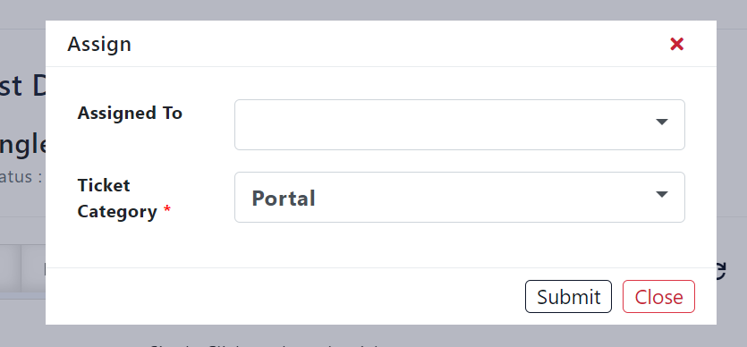
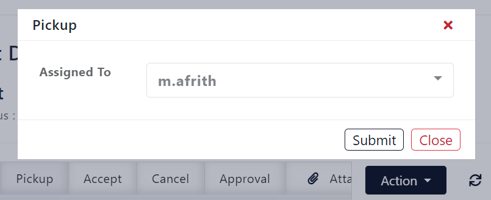
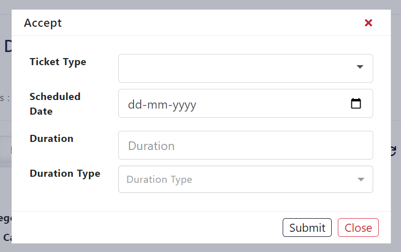
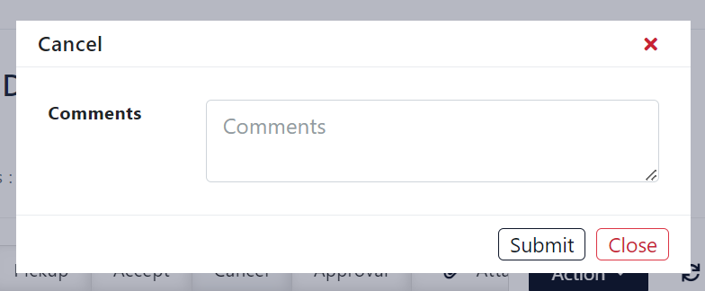
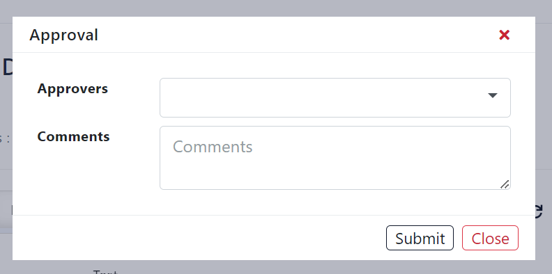
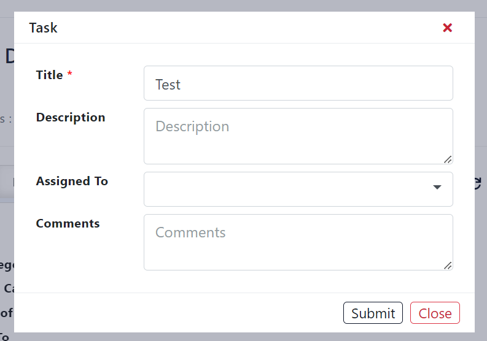
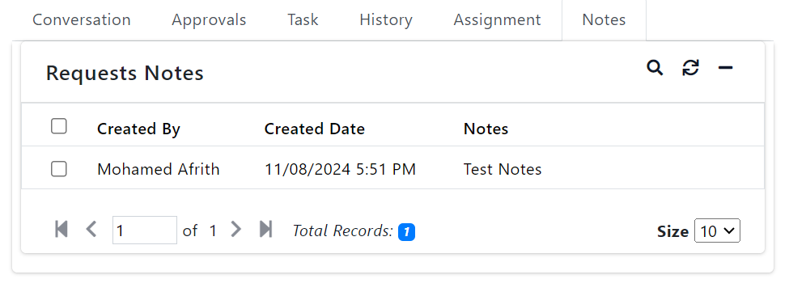

## Mawarid Ticketing System (Helpdesk) Documentation

### Introduction

A ticketing system, also known as a helpdesk system, is a crucial tool for managing customer support and internal IT issues efficiently. It serves as a centralized platform where users can submit requests or report problems, and support teams can track, prioritize, and resolve these issues systematically.

This is our `Mawarid Apps4x` Login page, the user can login by `username and password` or login through `Active directory` by using his company email. And the user can change the application language to arabic for his convenience.

This is the welcome page that the user will get after login to the application. Here the user can click the Helpdesk appliction to create a New Ticket Request.

*  The user can get menu access for the Requests, My Teams, Approvals and Task menus with their childmenus.

*  This is the User's Dashboard page, here the user can able to see his dashboard with overall his tickets status and progress.

*  Also the user can go to the ticket create page from the dashboard page by clicking the Create Request Card or click the Create Request menu or click the plus `(+)` icon on the top.

*  This is the Ticket Request Create page, here the user can create ticket request by filling this create form and submit.

*  Title for the request that the user going to create.

*  Choose the `Ticket Category` from the dropdown and `Ticket Sub Category` dropdown will load depends on the ticket category.

*  Here the `On Behalf of` field is available to create any ticket request on behalf of any other users.

*  The user can add text message or photo image to mention, about the issues he faced.

* The user can add any file attachments along with the ticket.

*  The User can get the menu role permission to access the Requests menu with 3 childmenus.

> 1. My Requests
> 2. Requests Assigned to me
> 3. Unassigned Requests

> #### Requests > My Requests

*  My Requests page shows the tickets, that the requests was created by the user. This shows the all tickets of the user even the ticket is in any status whether in `New, InProgress, Scheduled, Closed, ReOpen or in Cancelled` stage.

*  The User can see the Request's details by clicking the Title of the Request.

*  This My Request page shows the `Request Id, Title, Status, Category Name, Assigned To, Ticket Type, Scheduled Date, Duration, Description, Rec Id, Requester, Request Date and On Behalf of` fields with data.

*  The User can see the Ticket type details by clicking the Ticket type, this will show only after the ticket has been accept and scheduled.

> #### Requests > Requests Assigned to me

*  `Requests Assigned to me` - This is page shows the lists of tickets which are the tickets are assigned to the user.

*  This page also shows the same fields with data, which are in the My Requests page.

> #### Requests > Unassigned Requests

*  `Unassigned Requests` - This Unassigned Requests page shows the tickets, which the tickets are not assigned to anyone.

*  Here the technicians can take some actions in the request details page. Such actions are, `Assign, Pickup, Accept, Cancel and Approval`.

> #### Assign

*  This is an Assign button popup to assign the ticket request for other user/technician.

*  Also user/technician can assign the ticket requests for himself.

> #### Pickup

*  This is the Pickup button popup to pickup the ticket request which means assigning to himself.

> #### Accept

*  This is the Accept button popup, to accept and schedule the ticket request to work on it.

*  To Accept and Schedule the ticket request, choose the ticket type from the `dropdown, Schedule the date, Enter the Duration` in numbers and Choose the `Duration type` from the dropdown as hours or days.

> #### Cancel

*  This is Cancel button popup to cancel the ticket request with comment message for any other valid reasons.

> #### Approval

*  This is the Approval button popup, to send ticket request and get approval for the ticket requests from the higher officials to start the further works.

> #### Action > Task

*  This is the Task popup, to assign the ticket requests as a task to the technicians with title, description and comments.

> #### Requests > Ticket Details page

*  Requests menu has 3 child menus, the ticket details page is common in the 3 child menus with same details. Only the ticket assignment is different other than that ticket details page and status are same in the all 3 childmenus.

*  In the all the ticket details page, it shows the conversations, comments and status update of the ticket.

> #### Approvals

*  It shows the Request Approvals list with the data and the fields of `Request Id, User Id, User Name, Status, Action By and Action Date`.

> #### Task

*  It shows the list of Request Task with the data and the fields of `Request Id, Task Id, Title, Description, Assigned To and Status`.

> #### History

*  It shows the Status History of the Ticket Request, which the change of approval status history with the data and the fields of `Rec Id, Request Id, Status, Comments, Action by and Action Date`.

> #### Assignment

*  It Shows the Assignment History of the Ticket request with the data and fields of `Request Id, Title, Comments, Assigned To, Assigned To Name and Assigned Date`.

> #### Notes

*  It Shows the Requests Notes (Points) of the Ticket Request with data and the fields of `Created By, Created Date and Notes`.

> #### My Teams > Team Requests